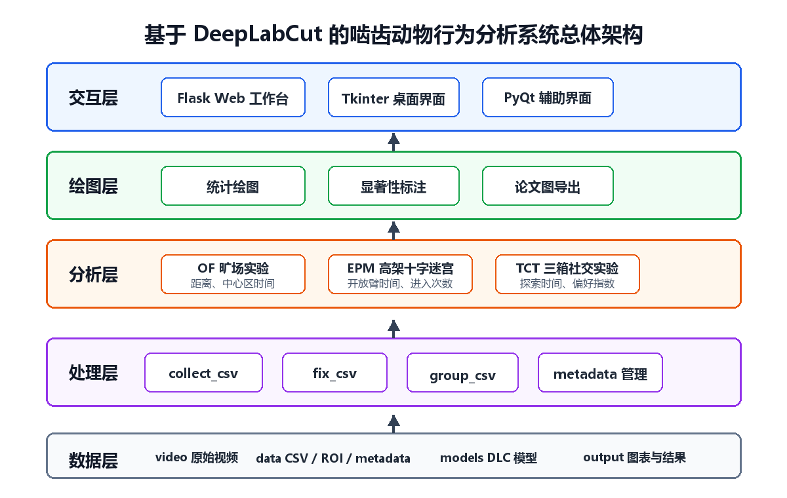
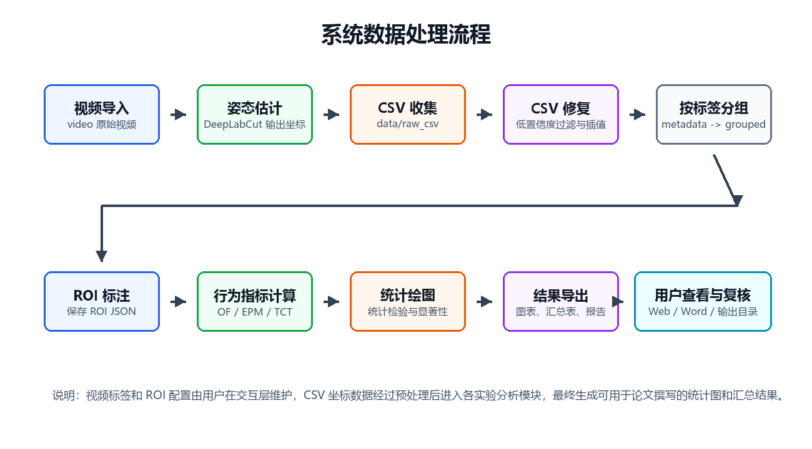

# 封面 {.unnumbered .unlisted}

本科生毕业论文（设计）

（辅修学士学位）

中文题目：基于 DeepLabCut 的啮齿动物行为分析系统设计与实现

英文题目：Design and Implementation of a Rodent Behavior Analysis System Based on DeepLabCut

学生姓名：（填写姓名）

教学号：（填写教学号）

学号：（填写学号）

指导教师：（填写指导教师）

职称：（填写职称）

辅修学士学位学院：计算机科学与技术学院

辅修学士学位专业：（填写专业全称）

主修学院：（填写主修学院）

主修专业：（填写主修专业）

2026年5月

\newpage

# 吉林大学学士学位论文（设计）承诺书 {.unnumbered .unlisted}

本人郑重承诺：所呈交的学士学位毕业论文（设计），是本人在指导教师的指导下，独立进行实验、设计、调研等工作基础上取得的成果。除文中已经注明引用的内容外，本论文（设计）不包含任何其他个人或集体已经发表或撰写的作品成果。对本人实验或设计中做出重要贡献的个人或集体，均已在文中以明确的方式注明。本人完全意识到本承诺书的法律结果由本人承担。

学士学位论文（设计）作者签名：

2026年5月20日

\newpage

# 摘要 {.unnumbered .unlisted}

基于 DeepLabCut 的啮齿动物行为分析系统设计与实现

随着计算机视觉和深度学习技术的发展，动物行为学实验逐渐由人工观察转向基于视频的自动化分析。啮齿动物常用于神经科学和药理学研究，旷场实验、高架十字迷宫实验和三箱社交实验分别用于评估运动能力、焦虑样行为和社交偏好。传统分析方法存在工作量大、主观性强、数据整理链条长等问题。针对上述问题，本文设计并实现了一套基于 DeepLabCut 姿态估计结果的啮齿动物行为分析系统。

系统以 Python 为主要开发语言，构建了视频标签管理、DLC 结果收集、CSV 预处理、ROI 标注、行为指标计算、统计绘图和 Web 工作台等模块。系统支持 OF、EPM 和 TCT 三类实验，能够根据关键点坐标与实验区域配置计算总运动距离、中心区停留时间、开放臂停留时间、进入次数、目标区域探索时间和社交偏好指数等指标，并生成轨迹图、热图、汇总表和论文风格统计图。

测试结果表明，系统能够对项目数据进行批量处理，减少人工整理工作量，提高指标计算和图表输出的一致性。本文工作将 DeepLabCut 姿态估计与行为学实验分析流程相结合，为实验室啮齿动物行为数据处理提供了一种自动化、模块化、可扩展的解决方案。

关键字：动物行为分析，DeepLabCut，计算机视觉，行为学实验，Flask

\newpage

# Abstract {.unnumbered .unlisted}

Design and Implementation of a Rodent Behavior Analysis System Based on DeepLabCut

With the development of computer vision and deep learning, animal behavior experiments are gradually shifting from manual observation to video-based automated analysis. Rodents are widely used in neuroscience and pharmacology. Open Field, Elevated Plus Maze and Three-Chamber Test are common paradigms for evaluating locomotor activity, anxiety-like behavior and social preference. Traditional analysis methods often involve heavy workload, subjective bias and fragmented data processing. To address these issues, this thesis designs and implements a rodent behavior analysis system based on pose estimation results generated by DeepLabCut.

The system is developed mainly in Python and includes video metadata management, DLC result collection, CSV preprocessing, ROI annotation, behavioral metric calculation, statistical plotting and a web-based workstation. It supports OF, EPM and TCT experiments. By combining key-point coordinates with ROI configurations, the system calculates total distance, center time, open-arm time, entries, target-zone exploration time and social preference index. It also generates trajectory plots, heat maps, summary tables and publication-style statistical figures.

The test results show that the system can process project datasets in batch, reduce manual workload, and improve the consistency of metric calculation and figure output. This work integrates DeepLabCut pose estimation with behavioral experiment analysis and provides an automated, modular and extensible solution for rodent behavior data processing.

Keywords: animal behavior analysis, DeepLabCut, computer vision, behavioral experiment, Flask

\newpage

# 目 录 {.unnumbered .unlisted}

（请在 Word/WPS 中于此处插入自动目录。目录不包含摘要和 Abstract，应包含第1章至第5章、参考文献和致谢。）

\newpage

# 第1章 绪论

## 1.1 研究背景与意义

动物行为学实验是神经科学、心理学、药理学和遗传学研究中的重要实验手段。通过观察动物在特定实验环境中的运动轨迹、停留区域、探索行为和社交选择，可以间接评估动物的焦虑水平、运动能力、探索欲望和社交偏好等行为特征。啮齿动物具有繁殖周期短、实验成本相对较低、行为范式成熟等特点，因此小鼠、大鼠等模型动物被广泛用于基础医学和生命科学研究。

在常见行为学实验中，旷场实验主要通过动物在开放场地中的移动距离、中心区停留时间和进入次数等指标评估自发活动能力和焦虑样行为；高架十字迷宫实验通过动物在开放臂、闭合臂和中心区中的停留时间与进入次数反映焦虑相关行为；三箱社交实验则通过动物对陌生同伴、熟悉同伴或物体区域的探索时间衡量社交能力与社交新奇偏好。这些实验的共同特点是依赖视频记录和空间区域判断。若采用人工观察方式，不仅耗时较长，而且容易受到观察者主观判断、疲劳程度和统计标准不一致的影响。

近年来，深度学习姿态估计方法为动物行为分析提供了新的技术路径。DeepLabCut 等工具能够在较少标注样本基础上训练动物关键点检测模型，并对实验视频输出逐帧坐标与置信度[1]。姿态估计解决了“从视频中提取动物位置”的问题，但实验室实际工作仍需要完成坐标清洗、实验区域标定、行为指标计算、结果分组、统计检验和论文图绘制等后续步骤。若这些步骤继续依赖手工处理，仍会形成较长的数据处理链条。

因此，设计一套能够衔接 DeepLabCut 输出结果并完成多实验范式行为分析的系统，具有较强的实际意义。一方面，该系统可以减少实验人员重复劳动，提高分析效率；另一方面，统一的程序化流程能够增强结果计算的一致性和可复现性；同时，模块化设计也有利于后续扩展更多行为范式和统计方法。

## 1.2 国内外研究现状

动物行为自动化分析经历了从人工计时、基于阈值的图像处理到深度学习姿态估计的发展过程。早期行为分析软件通常依赖背景差分、灰度阈值或轮廓检测定位动物位置，这类方法对光照变化、笼具反光、遮挡和动物颜色差异较为敏感。随着深度学习在图像识别领域的发展，基于卷积神经网络的关键点检测方法逐渐应用于动物姿态估计，能够在复杂背景下获得更稳定的坐标结果。

DeepLabCut 是一种常用的动物姿态估计工具，它允许研究者通过标注少量视频帧训练模型，并在后续视频中自动识别动物关键点。该方法降低了动物姿态估计的使用门槛，并被广泛应用于啮齿动物、鱼类、昆虫等多种实验对象[2]。然而，DeepLabCut 本身主要负责关键点检测，输出结果通常为 CSV、H5 等数据文件。对于具体实验范式，还需要结合实验装置结构和研究目的设计专门的分析逻辑。

在行为学实验分析方面，已有商业软件和开源工具能够完成部分实验的数据统计，但常常存在价格较高、实验范式固定、二次开发不便或与实验室现有数据命名规范不兼容等问题。对于实际科研项目而言，实验数据通常包含不同批次、不同处理条件和不同实验范式，且视频文件、模型文件、原始 CSV、修复 CSV 和统计结果之间需要建立稳定的数据组织关系。因此，面向具体实验室流程开发轻量级、可定制的分析系统，仍具有现实价值。

## 1.3 本文主要研究内容

本文围绕啮齿动物行为分析系统的设计与实现展开，主要研究内容如下。

（1）设计项目数据组织结构。系统将原始视频、DLC 输出、修复后 CSV、分组数据、ROI 配置和分析结果分别存放在统一目录中，并通过全局路径配置文件管理，降低路径硬编码带来的维护成本。

（2）实现视频元数据管理。系统支持对视频文件进行实验类型、组别、处理条件、小鼠编号和实验阶段等标签记录，并将元数据保存为 Excel 文件，为后续批量分组和统计分析提供依据。

（3）实现 CSV 预处理流程。系统能够收集 DeepLabCut 输出的 CSV 文件，并根据置信度阈值过滤低质量坐标，对缺失坐标进行插值处理，减少异常点对行为指标计算的影响。

（4）实现 OF、EPM、TCT 三类行为实验分析。系统依据 ROI 配置和动物坐标计算各实验所需指标，并输出轨迹图、热图和汇总表。

（5）实现统计绘图模块。系统提供柱状图、箱线图、小提琴图、散点图、配对图等多种图表类型，支持自动统计检验、显著性标注和论文风格图形导出。

（6）实现图形化操作界面。系统提供 Flask Web 工作台和桌面 GUI，使实验人员能够以可视化方式完成导入、预处理、ROI 标注、分析和绘图等操作。

## 1.4 论文结构安排

本文共分为五章。第1章介绍研究背景、研究意义、国内外研究现状和本文主要工作。第2章对系统需求进行分析，并给出总体架构、功能模块和数据流程设计。第3章阐述系统各核心模块的详细设计与实现，包括预处理、ROI 标注、行为分析、统计绘图和 Web 工作台。第4章对系统进行功能测试和结果分析，说明系统在项目数据上的运行情况。第5章总结全文工作，分析不足并提出后续改进方向。

# 第2章 系统需求分析与总体设计

## 2.1 系统需求分析

### 2.1.1 功能需求

根据啮齿动物行为实验数据处理流程，系统需要满足以下功能需求。

（1）视频管理与标签记录。系统应能够扫描指定视频目录下的实验视频，并允许用户为视频设置实验类型、实验组别、处理条件、小鼠编号和 TCT 阶段等标签。

（2）DLC 结果管理。系统应能够收集 DeepLabCut 生成的 CSV 结果文件，并将其统一整理到原始 CSV 目录中，便于后续处理。

（3）CSV 修复与分组。系统应能够根据置信度阈值过滤坐标点，对缺失坐标进行插值，并根据 metadata 标签把 CSV 复制到对应实验、组别和处理条件目录中。

（4）ROI 标注。系统应为不同实验提供区域标注工具，支持保存和读取 JSON 格式 ROI 配置。OF 实验需要标注笼具区域和中心区；EPM 实验需要标注开放臂、闭合臂和中心区；TCT 实验需要标注左箱、中箱和右箱。

（5）行为指标计算。系统应支持 OF、EPM、TCT 三类实验的自动分析，输出与实验范式相匹配的行为指标。

（6）图表绘制与统计检验。系统应根据分析汇总表绘制论文图，并输出统计检验结果，方便用户进行论文撰写和结果汇报。

（7）可视化工作台。系统应提供图形化操作界面，使用户无需频繁运行命令行脚本即可完成主要流程。

### 2.1.2 非功能需求

系统除功能需求外，还需要满足以下非功能需求。

（1）可维护性。系统应采用模块化结构，将配置、预处理、实验分析、绘图和界面分离，便于后续扩展。

（2）可复现性。系统应尽可能使用统一的数据目录和参数配置，使相同输入能够得到一致输出。

（3）易用性。系统应为非计算机专业实验人员提供可视化入口，降低使用难度。

（4）扩展性。系统应支持在现有 OF、EPM、TCT 之外继续增加新的行为实验模块。

（5）鲁棒性。系统应在文件缺失、置信度较低、命名不一致等情况下给出明确提示，避免静默失败。

## 2.2 系统总体架构

本系统采用分层模块化架构，主要包括数据层、处理层、分析层、绘图层和交互层。系统总体架构如图2-1所示。

数据层包括 video、data、models 和 output 等目录。video 目录保存原始实验视频；data 目录保存 raw_csv、fixed_csv、grouped、roi 和 metadata.xlsx；models 目录保存 DeepLabCut 模型；output 目录保存轨迹图、热图、汇总表和统计图。

处理层包括 collect_csv、fix_csv、group_csv 和 build_metadata 等模块，负责从 DeepLabCut 输出中收集 CSV、修复坐标数据、按标签分组数据和构建元数据表。

分析层包括 experiments/OF、experiments/EPM 和 experiments/TCT 三个子模块，分别实现旷场、高架十字迷宫和三箱社交实验的行为指标计算。

绘图层包括 plotting 模块，负责统计检验、图表类型、配色方案、显著性标注和论文风格参数设置。

交互层包括 Flask Web 工作台、Tkinter 桌面界面和 PyQt 界面。其中 Web 工作台作为推荐入口，提供导入视频、DLC 分析、预处理、ROI 标注、数据分析、绘图和 metadata 编辑功能。

## 2.3 数据流程设计

系统的数据流程可概括为：视频导入、姿态估计、CSV 收集、CSV 修复、按标签分组、ROI 标注、行为指标计算、统计绘图和结果导出。具体流程如图2-2所示。

首先，用户将视频文件放入 video 目录，并在系统中为视频添加实验标签。其次，DeepLabCut 对视频进行姿态估计，生成逐帧关键点坐标及 likelihood 置信度。随后，系统将 DLC 输出 CSV 复制到 data/raw_csv，并通过预处理模块生成 data/fixed_csv。接着，系统根据 metadata.xlsx 中的标签将 CSV 复制到 data/grouped 下的对应目录。用户完成 ROI 标注后，分析模块读取分组 CSV 和 ROI JSON，计算行为指标并输出汇总表。最后，绘图模块读取汇总表，生成统计图和统计检验结果。

## 2.4 开发环境与技术选型

本系统主要使用 Python 语言开发。Python 具有丰富的数据处理、图像处理和科学计算生态，适合快速构建科研数据分析工具。系统中主要技术选型如下。

在具体实现中，系统使用 OpenCV 完成视频帧读取和图像处理[3]，使用 Pandas 进行表格数据读取、清洗和汇总[4]，使用 Matplotlib 绘制轨迹图、热图和统计图[5]，并使用 SciPy 完成部分统计检验和科学计算任务[6]。

表2-1 系统主要技术选型

| 技术或库 | 作用 |
| --- | --- |
| Python | 系统主要开发语言 |
| pandas | 读取、清洗和保存 CSV、Excel 表格 |
| NumPy | 数值计算和坐标处理 |
| OpenCV | 视频帧读取和图像处理 |
| Matplotlib、Seaborn | 轨迹图、热图和统计图绘制 |
| SciPy | 统计检验和数据处理 |
| DeepLabCut | 动物关键点姿态估计 |
| Flask | Web 工作台后端 |
| HTML、CSS、JavaScript | Web 前端页面 |
| Tkinter、PyQt | 桌面图形界面 |

# 第3章 系统详细设计与实现

## 3.1 项目目录与配置模块实现

系统通过 config.py 和 config/paths.py 管理全局参数和路径。config.py 保存帧率、置信度阈值、分析时长和 CSV 修复相关参数。例如，系统默认视频帧率为 30 FPS，DLC 置信度阈值为 0.6，OF 和 EPM 默认分析 15 分钟，TCT 默认分析 10 分钟。将这些参数集中管理有利于不同实验脚本共享配置，也便于用户根据实验条件进行调整。

config/paths.py 使用 pathlib.Path 定义项目根目录、数据目录、ROI 文件路径和输出目录。相比在各脚本中直接写绝对路径，统一路径配置能够减少迁移项目时的修改成本，也使系统目录关系更清晰。

## 3.2 元数据管理模块实现

元数据管理是系统连接视频、CSV 和实验标签的重要环节。系统使用 data/metadata.xlsx 保存每个实验文件的标签信息，主要字段包括 FileName、Experiment、Group、Condition、MouseID 和 Phase。其中 Experiment 表示实验类型，如 OF、EPM 或 TCT；Group 表示实验组别，如 hM4Di 或 mCherry；Condition 表示处理条件，如 CNO 或 Saline；MouseID 表示小鼠编号；Phase 用于记录 TCT 实验中的 S、N、H 等阶段。

preprocessing/build_metadata.py 能够扫描 data/grouped 目录，从路径和文件名中推断实验标签，并生成 metadata.xlsx。preprocessing/metadata_utils.py 为分析脚本提供统一读取接口，分析模块优先从 metadata.xlsx 中读取标签，若找不到对应记录，则根据路径进行简单推断。这种设计既支持人工维护 metadata，也能在 metadata 不完整时提供容错能力。

在 Web 工作台中，导入页面负责扫描 video 目录下的视频文件，并允许用户为视频添加标签。根据实际流程，视频打标签只应生成或更新 metadata，不应立即触发 CSV 分组。CSV 分组应在预处理阶段完成。经过调整后，系统将“视频标签管理”和“CSV 分组处理”分离，使业务流程更加清晰。

## 3.3 CSV 预处理模块实现

DeepLabCut 输出的 CSV 通常包含多层表头，每个关键点包含 x、y 和 likelihood 三类数据。由于视频质量、遮挡、光照和模型误差等因素，部分帧可能出现置信度较低或坐标异常的情况。为了提高后续行为指标计算的稳定性，系统设计了 CSV 预处理流程。

collect_csv.py 负责从 video 目录中递归查找 DLC 输出 CSV，并将其复制到 data/raw_csv，统一命名为“视频名_result.csv”。fix_csv.py 读取 raw_csv 中的文件，根据 likelihood 阈值将低置信度坐标置为空值，并通过线性插值补全短时间缺失片段。group_csv.py 根据 metadata 中记录的实验类型、组别和处理条件，把修复后的 CSV 复制到 grouped 目录下相应位置。

在实际数据中，视频文件名和 CSV 文件名可能并不完全一致。例如，metadata 中保存的是相对视频路径，而 CSV 文件通常是去除 DLC 模型后缀后的结果文件名。为解决该问题，系统在分组模块中增加文件名映射规则：若 metadata 中为 mp4 文件，则将其转换为对应的“_result.csv”名称；若仍无法匹配，则根据时间戳前缀查找可能的 CSV 文件。这一处理提高了系统对实验数据命名差异的适应能力。

## 3.4 ROI 标注模块实现

ROI（Region of Interest）标注是行为分析中的关键步骤。系统需要知道实验装置中哪些区域属于中心区、开放臂、闭合臂、目标箱或对照箱，才能将动物坐标转换为行为指标。系统为 OF、EPM、TCT 三类实验分别实现了 ROI 标注工具。

OF ROI 工具以矩形区域为主，用户可在视频帧上标注每个笼具区域，并自动生成中心区。中心区面积可设置为笼具面积的 1/4 或 1/9，以适配不同实验标准。EPM ROI 工具支持通过十字形区域分割开放臂、闭合臂和中心区，并保存多边形点集。TCT ROI 工具支持标注三箱结构，将每个 cage 分为左箱、中箱和右箱。

ROI 配置以 JSON 文件保存。相比将区域坐标写入代码，JSON 配置更便于复用和修改。分析脚本运行时读取 ROI JSON，根据每帧坐标判断动物是否位于某一区域内。对于矩形 ROI，可通过坐标范围判断；对于多边形 ROI，可使用 OpenCV 的 pointPolygonTest 方法判断点是否在多边形内部。

## 3.5 OF 实验分析模块实现

旷场实验主要评估动物自发活动和焦虑样行为。系统在 OF 分析中读取每个 CSV 文件，并按照 cage 对坐标列进行解析。对于每只动物，系统根据 likelihood 阈值过滤无效坐标，计算相邻帧之间的欧氏距离，并根据实际场地尺寸将像素距离转换为厘米距离。

OF 实验的核心指标包括总运动距离、中心区停留时间、中心区进入次数和中心区停留百分比。中心区停留时间通过统计坐标落入中心 ROI 的帧数并除以 FPS 得到；进入次数通过判断动物从中心区外进入中心区的状态变化次数得到；总距离通过逐帧坐标差累加得到。系统还为每个文件生成轨迹图和热图，使用户能够直观查看动物活动范围和热点区域。

## 3.6 EPM 实验分析模块实现

高架十字迷宫实验包含开放臂、闭合臂和中心区。动物在开放臂中的停留时间通常被用于反映焦虑样行为。系统在 EPM 分析中读取多边形 ROI 配置，并根据每帧坐标判断动物所在区域。

EPM 分析模块计算开放臂停留时间、闭合臂停留时间、中心区停留时间、开放臂进入次数、闭合臂进入次数和总运动距离等指标。为了避免动物位于区域边界时产生误判，系统可根据中心区域和入口深度参数构建进入判定区域。分析结果保存为 Excel 汇总表，同时输出叠加 ROI 的轨迹图和热图。

## 3.7 TCT 实验分析模块实现

三箱社交实验用于评估动物社交能力和社交新奇偏好。系统根据文件名中的阶段信息判断当前实验属于 S 阶段、N 阶段或 H 阶段，并根据实验安排确定左右箱对应的角色。例如，在 S 阶段，某一侧可能为 Live，另一侧为 Toy；在 N 阶段，某一侧可能为 Old Friend，另一侧为 New Friend。

TCT 分析模块统计动物在左箱、右箱和中箱中的停留时间，并根据目标区域和对照区域计算偏好指数。偏好指数可表示为：

PI = (Target_Time_s - Control_Time_s) / (Target_Time_s + Control_Time_s)

其中 Target_Time_s 表示目标区域停留时间，Control_Time_s 表示对照区域停留时间。PI 越大，说明动物越偏向目标区域；PI 接近 0 时，说明两侧探索时间相近；PI 小于 0 时，说明动物更偏向对照区域。

## 3.8 统计绘图模块实现

系统的 plotting 模块为不同实验提供统一的论文图绘制能力。该模块包含图表配置、配色方案、统计检验、显著性标注和图形输出等功能。ChartConfig 数据类保存柱宽、点大小、透明度、误差线类型、显著性水平和图像分辨率等参数。palettes.py 定义 Nature Classic、Colorblind Safe、Science Bright 等配色方案，便于用户根据论文风格选择图形颜色。

statistics.py 根据数据类型自动执行统计检验。对于配对数据，系统可选择配对 t 检验或 Wilcoxon 符号秩检验；对于非配对数据，可选择独立样本 t 检验或 Mann-Whitney U 检验；对于多组数据，可执行方差分析或 Kruskal-Wallis 检验。significance.py 负责在图中绘制显著性括号和星号标记。

OF 和 EPM 绘图入口调用通用 plot_experiment 函数，只需定义各自的指标列表即可。TCT 绘图由于同时涉及 Time 和 PI 两类结果，采用专门布局实现，使图形更符合三箱社交实验的展示习惯。

## 3.9 Web 工作台实现

Web 工作台基于 Flask 实现，后端 routes 目录按照功能划分为 import_routes、dlc_routes、preprocess_routes、roi_routes、analyze_routes、plot_routes、metadata_routes 和 task_routes。前端通过 HTML、CSS 和 JavaScript 实现页面切换、表格编辑、按钮操作和日志显示。

由于 DLC 分析、CSV 修复和行为分析可能耗时较长，系统设计了 TaskRunner 后台任务执行器。TaskRunner 使用线程执行耗时任务，并捕获标准输出和错误输出，将日志写入队列。前端通过 Server-Sent Events 获取任务日志和进度信息，使用户能够实时查看处理状态。

Web 工作台主要页面包括导入视频、DLC 分析、预处理、ROI 标注、数据分析、绘图设置和元数据编辑。导入页面用于视频扫描和标签保存；预处理页面用于修复 CSV、按标签分组和构建 metadata；分析页面用于选择实验类型并运行行为分析；绘图页面用于选择数据源、图表类型、配色和统计参数。

# 第4章 系统测试与结果分析

## 4.1 测试环境

系统在 Windows 环境下进行开发和测试，项目目录为 behavior_analyze。项目中包含 OF、EPM、TCT 三类实验视频、DeepLabCut 输出 CSV、ROI JSON 配置、metadata.xlsx 和部分输出结果。测试重点包括模块导入、Web 工作台启动、视频扫描、metadata 保存、CSV 分组、实验分析和绘图输出。

## 4.2 功能测试

### 4.2.1 视频导入与标签保存测试

测试时，系统能够递归扫描 video 目录下的视频文件，并在导入页面显示相对路径。用户可为视频填写 Experiment、Group、Condition、MouseID 和 Phase 等字段，并保存到 data/metadata.xlsx。保存后，系统不再立即执行 CSV 分组，避免视频标签管理阶段与 CSV 文件处理阶段混淆。

表4-1 视频标签保存测试结果

| 测试项 | 预期结果 | 实际结果 |
| --- | --- | --- |
| 扫描 video 目录 | 显示实验视频列表 | 通过 |
| 保存标签 | 写入 metadata.xlsx | 通过 |
| 保存后自动分组 CSV | 不触发自动分组 | 通过 |

### 4.2.2 CSV 分组测试

在预处理阶段，系统根据 metadata.xlsx 将 CSV 文件复制到 grouped 目录。由于部分视频名称与 CSV 名称不完全一致，分组模块加入了 mp4 到 _result.csv 的映射和时间戳前缀匹配机制。测试结果显示，系统能够将已有 raw_csv 中的文件按 metadata 标签分组。若 fixed_csv 目录为空，系统会回退使用 raw_csv 并给出提示，提醒用户先运行“修复 CSV”以获得修复后的数据。

表4-2 CSV 分组测试结果

| 测试项 | 预期结果 | 实际结果 |
| --- | --- | --- |
| metadata 文件存在 | 读取标签进行分组 | 通过 |
| FileName 为 mp4 | 自动映射到 _result.csv | 通过 |
| CSV 名称带额外小鼠编号 | 按时间戳前缀匹配 | 通过 |
| fixed_csv 为空 | 提示使用 raw_csv | 通过 |

### 4.2.3 ROI 标注测试

系统已包含 OF_roi_regions.json、EPM_ROI.json 和 TCT_ROI_Config.json 三类 ROI 配置文件。分析模块能够读取对应 JSON 文件，并根据区域定义进行坐标归属判断。ROI 标注工具可从视频中截取帧图像，并通过图形界面绘制区域。

### 4.2.4 行为分析测试

行为分析测试分别针对 OF、EPM 和 TCT 三类实验。系统读取 grouped 目录中的 CSV 文件和 ROI 配置，按实验类型计算行为指标。OF 模块输出总距离、中心区时间和进入次数；EPM 模块输出开放臂时间、闭合臂时间、中心区时间和距离；TCT 模块输出目标区时间、对照区时间和 PI。分析过程中，系统生成轨迹图和热图，便于用户检查定位结果和区域判断是否合理。

### 4.2.5 绘图模块测试

绘图模块读取分析汇总表后，能够生成 PDF 或 PNG 格式统计图。系统支持多种图表类型和配色方案，并输出统计检验 JSON 文件。测试表明，绘图模块能够根据实验指标自动生成图形，并在图中添加个体散点、误差线和显著性标注。

## 4.3 测试结果分析

从测试结果看，系统已能够覆盖啮齿动物行为分析的核心流程。与人工整理相比，系统将视频标签、CSV 清洗、实验分组、ROI 判断、指标计算和图形输出纳入统一流程，减少了重复操作。尤其在多批次、多处理条件的数据场景下，metadata 和 grouped 目录结构能够帮助用户保持数据组织一致。

同时，测试也暴露出系统仍需改进的问题。首先，项目依赖较多，但 requirements.txt 尚未完整列出所有依赖，不利于环境复现。其次，项目中仍包含较多大型视频、模型和压缩包，若直接纳入代码仓库会影响版本管理。再次，部分模块存在大小写导入、旧路径残留和中英文编码显示不一致等问题，需要进一步整理。最后，系统当前主要面向项目已有实验范式，若要支持更多行为实验，还需要抽象更通用的 ROI 和指标计算接口。

# 第5章 结论与展望

## 5.1 结论

本文设计并实现了一套基于 DeepLabCut 的啮齿动物行为分析系统。系统围绕实验室行为学数据处理流程，将视频标签管理、DLC 结果收集、CSV 预处理、ROI 标注、OF/EPM/TCT 行为指标计算、统计绘图和 Web 工作台集成到同一项目中。通过模块化设计，系统能够对不同实验类型采用不同分析逻辑，同时共享路径配置、metadata 管理和绘图模块。

本文主要完成了以下工作。

（1）建立了面向行为学实验的数据目录结构和全局配置机制，降低了多脚本协作中的路径管理复杂度。

（2）实现了视频元数据管理和 CSV 预处理流程，使实验标签与后续统计分析建立关联。

（3）实现了 OF、EPM、TCT 三类实验的 ROI 标注和行为指标计算，能够输出轨迹图、热图和汇总表。

（4）实现了统一统计绘图模块，支持多种图表类型、自动统计检验和论文风格图形输出。

（5）实现了 Flask Web 工作台和桌面图形界面，提高了系统的易用性。

总体来看，本系统能够满足项目数据的基本分析需求，并为实验室动物行为数据处理提供较完整的软件工具链。

## 5.2 不足与展望

虽然系统已实现核心功能，但仍存在一些不足。

（1）依赖环境尚需完善。后续应补充 requirements.txt 或 conda environment.yml，明确 Python 版本和第三方库版本，提升项目可复现性。

（2）数据与代码需要进一步分离。视频、模型和压缩包体积较大，建议后续将大型数据文件放入独立数据盘或对象存储，代码仓库仅保留程序、配置示例和小规模测试数据。

（3）命名规范仍需统一。当前项目中部分视频、CSV 和 metadata 文件名存在空格、缺失编号或大小写不一致的情况，后续可设计统一命名规范和自动校验工具。

（4）异常处理和日志提示仍可增强。系统应对 ROI 缺失、CSV 列格式异常、DLC 结果缺失等情况给出更明确的解决建议。

（5）算法通用性可继续提升。后续可抽象统一的区域判断接口和指标定义框架，使系统能够支持更多行为范式，如水迷宫、新物体识别实验和条件位置偏爱实验等。

未来工作可从工程化和科研应用两个方向继续推进。在工程化方面，完善环境配置、单元测试、数据校验和文档说明；在科研应用方面，引入更多行为指标、统计模型和可视化方式，并与实验记录系统结合，实现从实验设计到结果报告的更完整流程。

# 参考文献 {.unnumbered}

[1] Mathis A, Mamidanna P, Cury K M, et al. DeepLabCut: markerless pose estimation of user-defined body parts with deep learning[J]. Nature Neuroscience, 2018, 21(9): 1281-1289. DOI: 10.1038/s41593-018-0209-y.

[2] Nath T, Mathis A, Chen A C, et al. Using DeepLabCut for 3D markerless pose estimation across species and behaviors[J]. Nature Protocols, 2019, 14(7): 2152-2176. DOI: 10.1038/s41596-019-0176-0.

[3] OpenCV Team. OpenCV: Open Source Computer Vision Library[EB/OL]. [2026-05-09]. https://opencv.org/.

[4] McKinney W. Data structures for statistical computing in Python[C]//Proceedings of the 9th Python in Science Conference. Austin: SciPy, 2010: 56-61.

[5] Hunter J D. Matplotlib: A 2D Graphics Environment[J]. Computing in Science & Engineering, 2007, 9(3): 90-95.

[6] Virtanen P, Gommers R, Oliphant T E, et al. SciPy 1.0: fundamental algorithms for scientific computing in Python[J]. Nature Methods, 2020, 17: 261-272.

[7] Waskom M L. seaborn: statistical data visualization[J]. Journal of Open Source Software, 2021, 6(60): 3021.

[8] Palan S, Schitter C. Prolific.ac—A subject pool for online experiments[J]. Journal of Behavioral and Experimental Finance, 2018, 17: 22-27.

[9] Pellow S, Chopin P, File S E, Briley M. Validation of open:closed arm entries in an elevated plus-maze as a measure of anxiety in the rat[J]. Journal of Neuroscience Methods, 1985, 14(3): 149-167.

[10] Crawley J N. Behavioral phenotyping strategies for mutant mice[J]. Neuron, 2008, 57(6): 809-818.

# 致谢 {.unnumbered}

在本毕业设计完成过程中，感谢指导教师在选题、系统设计、实验流程和论文撰写方面给予的指导和帮助。老师严谨的治学态度和耐心的指导使我能够将计算机技术与动物行为学实验需求结合起来，逐步完成系统设计与实现。

感谢实验室同学在数据整理、实验范式理解和系统测试过程中提供的帮助。通过与同学交流，我进一步理解了 OF、EPM 和 TCT 等行为学实验的实际应用场景，也发现了系统在文件命名、操作流程和结果输出方面需要改进的细节。

感谢学院提供的学习平台和课程训练，使我具备了使用 Python、数据处理、Web 开发和软件工程方法解决实际问题的能力。最后，感谢家人和朋友在学习和生活中给予的支持与鼓励。

由于本人能力和时间有限，本文和系统仍有不足之处，恳请各位老师批评指正。
